---


[](https://github.com/PyCQA/bandit)


# 🎯 Hệ Thống Quản Lý Doanh Nghiệp - Odoo FITDNU

Hệ thống ERP tích hợp đầy đủ được xây dựng trên nền tảng Odoo 16, bao gồm các module tùy chỉnh cho quản lý nhân sự, dự án, công việc và thông báo nội bộ.

## 📋 Mục lục

- [Tính năng chính](#-tính-năng-chính)
- [Các Module Tùy Chỉnh](#-các-module-tùy-chỉnh)
- [Yêu cầu hệ thống](#-yêu-cầu-hệ-thống)
- [Cài đặt](#-cài-đặt)
- [Cấu hình](#-cấu-hình)
- [Demo & Hướng dẫn sử dụng](#-demo--hướng-dẫn-sử-dụng)
- [Cấu trúc dự án](#-cấu-trúc-dự-án)

## ✨ Tính năng chính

### 🏢 Quản lý Doanh nghiệp Toàn diện
- 👥 **Quản lý Nhân sự**: Hồ sơ nhân viên, phòng ban, chức vụ
- 📊 **Quản lý Dự án**: Theo dõi dự án, milestone, tiến độ
- ✅ **Quản lý Công việc**: Task management, phân công, deadline
- 📬 **Thông báo Thông minh**: Hệ thống thông báo đa cấp, realtime
- 💬 **Chat Nội bộ**: Giao tiếp team, phòng chat theo dự án

### 🚀 Tích hợp Odoo Core
- 📦 **Kho & Bán hàng**: Inventory, Sales, Purchase
- 💰 **Kế toán**: Accounting, Invoicing
- 🏭 **Sản xuất**: Manufacturing, MRP
- 🌐 **Website & E-commerce**: Website builder, Online store
- 📧 **Marketing**: Email marketing, Social media

## 🎨 Các Module Tùy Chỉnh

### 1️⃣ Quản lý Nhân sự (`nhan_su`)
**Mô tả**: Module quản lý toàn diện về nhân viên và tổ chức

**Tính năng**:
- 👤 Quản lý hồ sơ nhân viên (họ tên, email, điện thoại, địa chỉ)
- 🏢 Quản lý phòng ban và cơ cấu tổ chức
- 💼 Quản lý chức vụ và cấp bậc
- 📊 Dashboard tổng quan nhân sự
- 🔍 Tìm kiếm và lọc nhân viên nâng cao

**Đối tượng sử dụng**: HR Manager, Admin

---

### 2️⃣ Quản lý Dự án (`quan_ly_du_an`)
**Mô tả**: Hệ thống quản lý dự án chuyên nghiệp với workflow rõ ràng

**Tính năng**:
- 📊 Tạo và quản lý dự án
- 👥 Phân công nhân viên vào dự án
- 📅 Theo dõi tiến độ và deadline
- 🎯 Quản lý milestone và deliverables
- 💬 Chatter và thảo luận nhóm
- 📈 Báo cáo tiến độ dự án

**Đối tượng sử dụng**: Project Manager, Team Lead

---

### 3️⃣ Quản lý Công việc (`quan_ly_cong_viec`)
**Mô tả**: Task management linh hoạt, tích hợp với dự án và nhân sự

**Tính năng**:
- ✅ Tạo và phân công công việc
- 🎯 Gắn công việc với dự án cụ thể
- ⏰ Quản lý deadline và reminder
- 📊 Theo dõi trạng thái (Mới, Đang làm, Hoàn thành, Hủy)
- 🔔 Thông báo tự động cho người được phân công
- 📝 Ghi chú và comment trên công việc
- 📎 Đính kèm file và tài liệu

**Đối tượng sử dụng**: Tất cả nhân viên, Manager

---

### 4️⃣ Hệ thống Thông báo (`thong_bao`)
**Mô tả**: Hệ thống thông báo thông minh với UI hiện đại

**Tính năng**:
- 🔔 **5 loại thông báo**:
  - 📘 Thông tin (Info)
  - ⚠️ Cảnh báo (Warning)
  - ✅ Thành công (Success)
  - ❌ Lỗi (Error)
  - 🚨 Khẩn cấp (Urgent)

- 🎯 **4 mức độ ưu tiên**: Thấp, Trung bình, Cao, Khẩn cấp
- 🏷️ **Tags** để phân loại thông báo
- 👥 **Gửi đến nhiều người** cùng lúc
- ⏰ **Quản lý thời hạn** và cảnh báo quá hạn
- 📊 **Dashboard thống kê**: Tỉ lệ đã đọc, phân bố theo loại
- 🔗 **Liên kết** với Nhân sự, Dự án, Công việc
- 💬 **Chatter** để thảo luận
- 📧 **Gửi email** tự động
- 🎨 **Multiple views**: Kanban, Calendar, List, Form

**Đối tượng sử dụng**: Admin, Manager, tất cả nhân viên

---

### 5️⃣ Chat Nội bộ (`chat_noi_bo`)
**Mô tả**: Hệ thống chat realtime cho team và dự án

**Tính năng**:
- 💬 Tạo phòng chat cho nhóm, dự án, bộ phận
- 👥 Thêm/xóa thành viên từ danh sách nhân viên
- 📊 Mỗi dự án có phòng chat riêng
- 📝 Gửi tin nhắn text và file đính kèm
- ✅ Trạng thái đọc/chưa đọc
- 🔔 Thông báo tin nhắn mới realtime
- 🔍 Tìm kiếm tin nhắn và lịch sử
- 📎 Quản lý file đính kèm

**Đối tượng sử dụng**: Tất cả nhân viên

---

### 6️⃣ AI Chatbot Assistant (`ai_chatbot`)
**Mô tả**: Trợ lý AI thông minh tích hợp vào Chat Nội bộ để hỗ trợ quản lý công việc và dự án

**Tính năng**:
- 🤖 **AI Assistant tích hợp**: Trực tiếp trong phòng chat nội bộ
- ❓ **Trả lời câu hỏi**: Về task, deadline, người phụ trách, thông tin dự án
- 📝 **Tóm tắt cuộc trò chuyện**: Tự động tóm tắt nội dung chat trong phòng
- ✅ **Tạo task từ chat**: Chuyển đổi yêu cầu thành công việc cụ thể
- ⏰ **Cảnh báo thông minh**: Nhắc nhở về deadline và công việc trễ hạn
- 🎯 **Gợi ý ưu tiên**: Đề xuất task tiếp theo dựa trên độ ưu tiên
- 📊 **Phân tích dự án**: Báo cáo tình hình tiến độ và hiệu suất

**Cách sử dụng**:
- Trong bất kỳ phòng chat nào, gõ `@ai` trước câu hỏi
- Ví dụ: 
  - `@ai có bao nhiêu task?`
  - `@ai tóm tắt chat hôm nay`
  - `@ai task nào sắp hết hạn?`

**Đối tượng sử dụng**: Tất cả nhân viên, đặc biệt hữu ích cho Manager và Team Lead

## 💻 Yêu cầu hệ thống

### Phần cứng tối thiểu
- **RAM**: 4GB (khuyến nghị 8GB+)
- **CPU**: 2 cores (khuyến nghị 4+ cores)
- **Disk**: 20GB trống (khuyến nghị SSD)

### Phần mềm
- **OS**: Ubuntu 20.04+ / Debian 11+ / Windows 10+ (với WSL2)
- **Python**: 3.10+
- **PostgreSQL**: 12+
- **Docker & Docker Compose**: Latest version
- **Git**: Latest version

---

# 🚀 Cài đặt

## 1. Clone project

```bash
git clone https://github.com/danganh1009/TTDN-16-04-N9.git
cd TTDN-16-04-N9
```

## 2. Cài đặt dependencies hệ thống (Ubuntu/Debian)

```bash
sudo apt-get update
sudo apt-get install -y \
    libxml2-dev \
    libxslt-dev \
    libldap2-dev \
    libsasl2-dev \
    libssl-dev \
    python3.10-distutils \
    python3.10-dev \
    build-essential \
    libffi-dev \
    zlib1g-dev \
    python3.10-venv \
    libpq-dev \
    git \
    wget
```

## 3. Tạo môi trường ảo Python

```bash
# Tạo virtual environment
python3.10 -m venv ./venv

# Kích hoạt virtual environment
source venv/bin/activate  # Linux/Mac
# Hoặc
.\venv\Scripts\activate   # Windows
```

## 4. Cài đặt Python packages

```bash
pip install --upgrade pip
pip install wheel
pip install -r requirements.txt
```

## 5. Setup PostgreSQL Database với Docker

```bash
# Khởi động PostgreSQL container
docker-compose up -d

# Kiểm tra container đang chạy
docker ps

# Kiểm tra logs (nếu cần)
docker-compose logs -f
```

**Thông tin database mặc định**:
- Host: `localhost`
- Port: `5432`
- Database: `odoo`
- User: `odoo`
- Password: `odoo`

---

# ⚙️ Cấu hình

## 1. Tạo file cấu hình Odoo

Tạo file `odoo.conf` từ template:

```bash
cp odoo.conf.template odoo.conf
```

Hoặc tạo file `odoo.conf` với nội dung:

```ini
[options]
# Đường dẫn addons
addons_path = addons

# Cấu hình database
db_host = localhost
db_port = 5432
db_user = odoo
db_password = odoo
db_name = False  # False để cho phép chọn DB khi login

# Cấu hình server
xmlrpc_port = 8069
longpolling_port = 8072

# Log
logfile = /var/log/odoo/odoo.log
log_level = info

# Development mode (bỏ comment dòng dưới khi dev)
# dev_mode = reload,qweb,werkzeug,xml
```

## 2. Tạo thư mục log (optional)

```bash
sudo mkdir -p /var/log/odoo
sudo chown -R $USER:$USER /var/log/odoo
```

## 3. Khởi chạy Odoo

### Chế độ development

```bash
# Chạy với auto-reload khi code thay đổi
python odoo-bin -c odoo.conf --dev=all -d odoo_dev -u all

# Hoặc chỉ update module cụ thể
python odoo-bin -c odoo.conf --dev=all -d odoo_dev -u nhan_su,thong_bao,chat_noi_bo
```

### Chế độ production

```bash
python odoo-bin -c odoo.conf
```

### Các tham số hữu ích

```bash
# Khởi tạo database mới và cài đặt module
python odoo-bin -c odoo.conf -d <tên_database> -i <tên_module>

# Update module
python odoo-bin -c odoo.conf -d <tên_database> -u <tên_module>

# Chạy với development mode
python odoo-bin -c odoo.conf --dev=all

# Chỉ định database
python odoo-bin -c odoo.conf -d odoo_prod

# Không load demo data
python odoo-bin -c odoo.conf --without-demo=all
```

## 4. Truy cập hệ thống

Mở trình duyệt và truy cập:
- **URL**: http://localhost:8069
- **Email**: admin
- **Password**: admin

---

# 📖 Demo & Hướng dẫn sử dụng

## 🎬 Khởi tạo Database và Module

### Bước 1: Tạo Database mới

1. Truy cập http://localhost:8069
2. Click **"Create Database"**
3. Điền thông tin:
   - **Database Name**: `odoo_demo`
   - **Email**: `admin@example.com`
   - **Password**: `admin`
   - **Language**: `Vietnamese (VN)`
   - **Load demonstration data**: ✅ (Tích chọn để có dữ liệu demo)
4. Click **"Create Database"**

### Bước 2: Cài đặt Module Custom

1. Sau khi tạo database, login vào hệ thống
2. Vào **Apps** (Ứng dụng)
3. Remove filter **"Apps"** để hiện tất cả module
4. Tìm và cài đặt các module theo thứ tự:

**Thứ tự cài đặt (quan trọng)**:
```
1. nhan_su (Quản lý Nhân sự) - Module cơ sở
   ↓
2. quan_ly_du_an (Quản lý Dự án) - Phụ thuộc nhan_su
   ↓
3. quan_ly_cong_viec (Quản lý Công việc) - Phụ thuộc nhan_su, quan_ly_du_an
   ↓
4. thong_bao (Thông báo) - Phụ thuộc nhan_su, quan_ly_du_an, quan_ly_cong_viec
   ↓
5. chat_noi_bo (Chat nội bộ) - Phụ thuộc nhan_su, quan_ly_du_an
   ↓
6. ai_chatbot (AI Chatbot Assistant) - Phụ thuộc nhan_su, chat_noi_bo, quan_ly_cong_viec, quan_ly_du_an
```

---

## 👥 Demo Module Quản lý Nhân sự

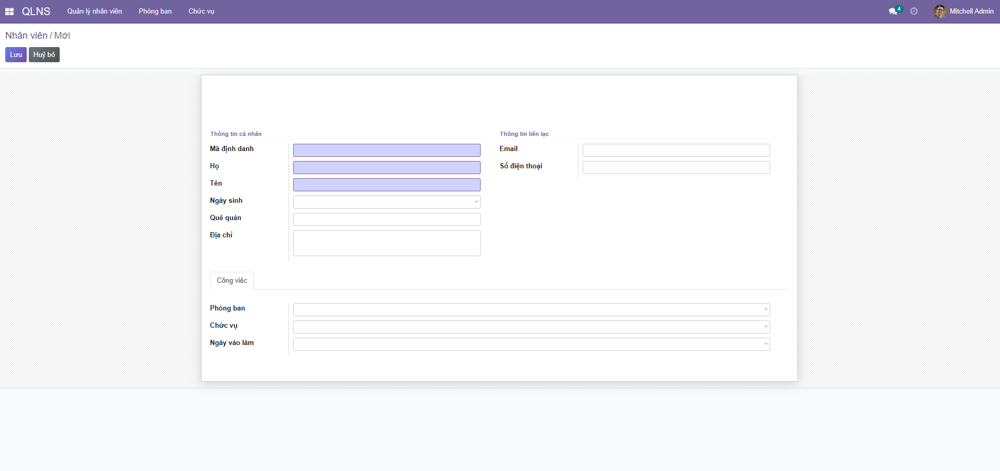

### Tạo Nhân viên mới

1. Vào **Nhân sự** → **Nhân viên** → **Create**
2. Điền thông tin:
   ```
   Họ tên: Nguyễn Văn A
   Email: nguyenvana@company.com
   Điện thoại: 0912345678
   Phòng ban: IT
   Chức vụ: Developer
   Địa chỉ: Hà Nội
   ```
3. Click **Save**

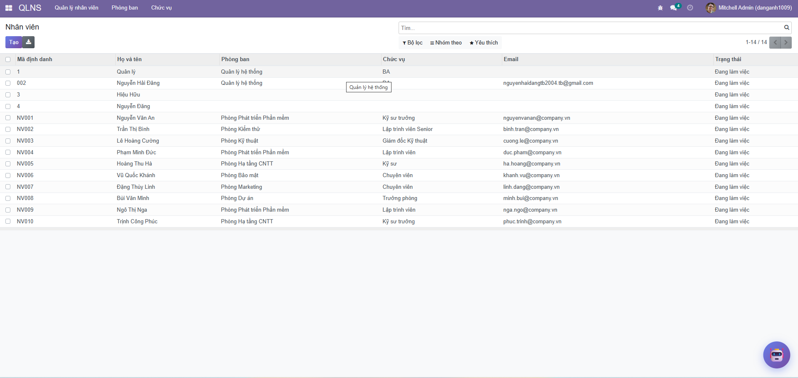

### Quản lý Phòng ban

1. Vào **Nhân sự** → **Phòng ban** → **Create**
2. Tạo các phòng ban:
   - IT Department
   - Marketing Department
   - Sales Department
   - HR Department

#### 📸 Screenshots


*Dashboard tổng quan quản lý nhân sự*


*Form tạo/chỉnh sửa thông tin nhân viên*

---

## 📊 Demo Module Quản lý Dự án

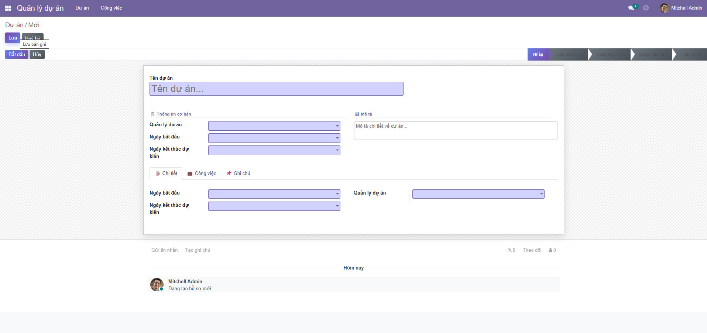

### Tạo Dự án mới

1. Vào **Dự án** → **Dự án** → **Create**
2. Điền thông tin:
   ```
   Tên dự án: Website Ecommerce
   Mô tả: Xây dựng website bán hàng online
   Ngày bắt đầu: 01/01/2026
   Ngày kết thúc: 31/03/2026
   Quản lý: Nguyễn Văn A
   ```
3. Tab **Thành viên**: Thêm các nhân viên vào dự án
4. Click **Save**

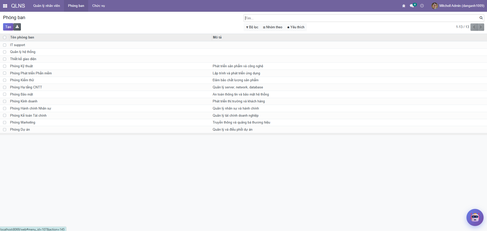

### Theo dõi tiến độ

- Sử dụng view **Kanban** để xem tổng quan
- Sử dụng view **List** để xem chi tiết
- Sử dụng view **Calendar** để xem timeline

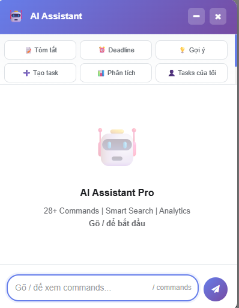

---

## ✅ Demo Module Quản lý Công việc

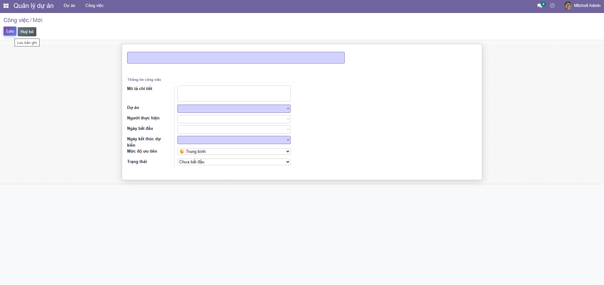

### Tạo Công việc mới

1. Vào **Công việc** → **Công việc** → **Create**
2. Điền thông tin:
   ```
   Tên công việc: Thiết kế giao diện trang chủ
   Dự án: Website Ecommerce
   Người thực hiện: Nguyễn Văn B
   Ngày bắt đầu: 05/01/2026
   Deadline: 15/01/2026
   Mức độ ưu tiên: Cao
   Trạng thái: Đang làm
   Mô tả: Thiết kế UI/UX cho trang chủ website
   ```
3. Đính kèm file thiết kế (nếu có)
4. Click **Save**

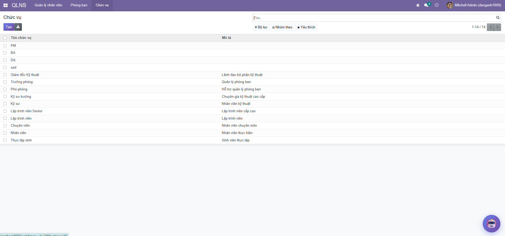

### Workflow công việc

```
Mới → Đang làm → Hoàn thành
  ↓                ↓
  └───────→ Hủy ←─┘
```

### Nhận thông báo

- Khi được phân công công việc → Nhận thông báo email & in-app
- Khi công việc sắp hết hạn → Nhận reminder
- Khi có comment mới → Nhận thông báo

#### 📸 Screenshots


*Kanban board quản lý công việc theo trạng thái*


*Form chi tiết công việc với đầy đủ thông tin*

---

## 📬 Demo Module Thông báo

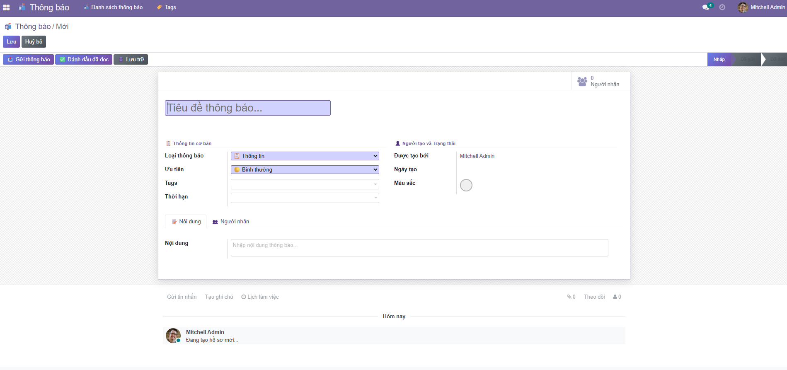

### Tạo Thông báo mới

1. Vào **Thông báo** → **Thông báo** → **Create**
2. Điền thông tin:
   ```
   Tiêu đề: [QUAN TRỌNG] Họp team về dự án Website
   Loại: 🚨 Khẩn cấp
   Mức độ ưu tiên: Khẩn cấp
   Nội dung: Họp team vào 9h sáng ngày mai tại phòng họp A
   Người nhận: [Chọn nhiều nhân viên]
   Thời hạn: 02/02/2026 09:00
   Tags: meeting, urgent
   ```
3. Click **Gửi thông báo**

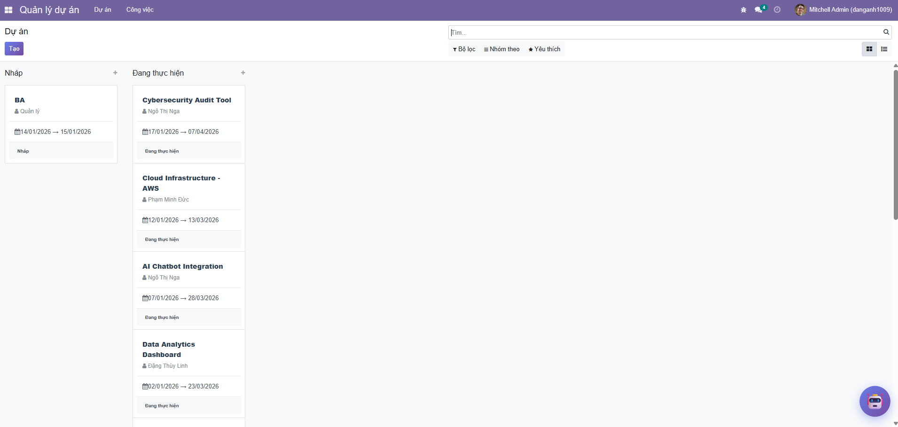

### Dashboard Thống kê

Vào **Thông báo** → **Dashboard** để xem:
- 📊 Tổng số thông báo theo loại
- 👥 Tỉ lệ đã đọc/chưa đọc
- 📈 Biểu đồ phân bố theo thời gian
- ⚠️ Thông báo quá hạn
- 🎯 Thông báo theo mức độ ưu tiên

### Các loại thông báo

| Loại | Icon | Sử dụng cho |
|------|------|-------------|
| Thông tin | 📘 | Thông báo chung, tin tức |
| Cảnh báo | ⚠️ | Cần lưu ý, chú ý |
| Thành công | ✅ | Hoàn thành công việc, milestone |
| Lỗi | ❌ | Báo lỗi, sự cố |
| Khẩn cấp | 🚨 | Yêu cầu xử lý ngay |

#### 📸 Screenshots


*Danh sách thông báo với các loại và mức độ ưu tiên*


*Kanban view thông báo theo trạng thái đọc/chưa đọc*

---

## 💬 Demo Module Chat Nội bộ

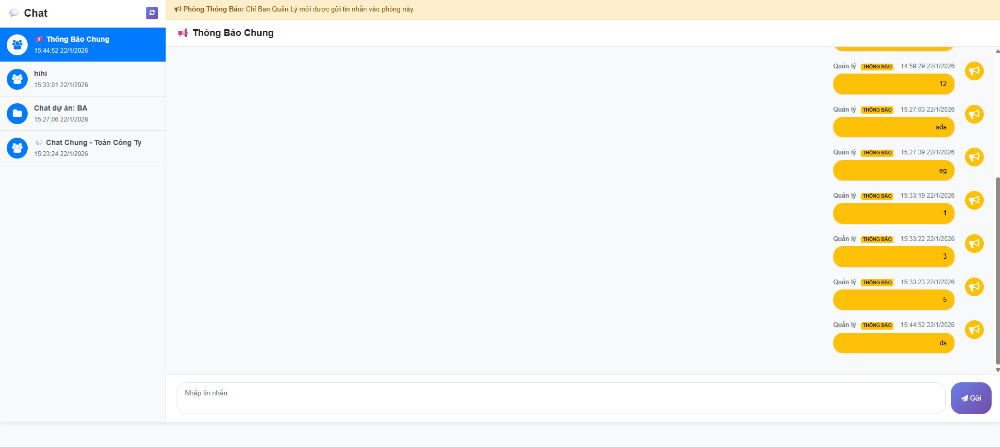

### Tạo Phòng chat mới

1. Vào **Chat** → **Phòng chat** → **Create**
2. Điền thông tin:
   ```
   Tên phòng: Team IT - Website Project
   Mô tả: Thảo luận về dự án Website Ecommerce
   Loại: Dự án
   Liên kết dự án: Website Ecommerce
   ```
3. Tab **Thành viên**: Thêm nhân viên vào phòng
4. Click **Save**

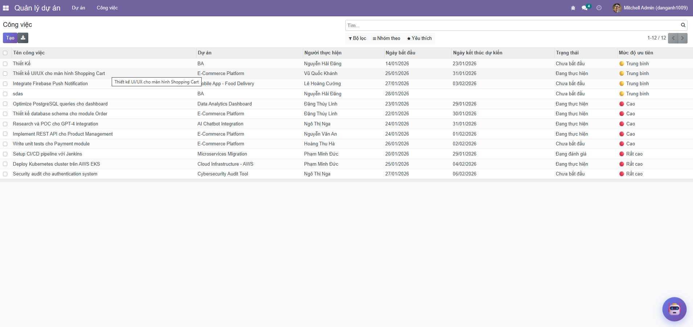

### Gửi tin nhắn

1. Vào phòng chat vừa tạo
2. Nhập tin nhắn ở box chat bên dưới
3. Có thể:
   - 📝 Gửi text
   - 📎 Đính kèm file
   - 😊 Sử dụng emoji
4. Click **Gửi**

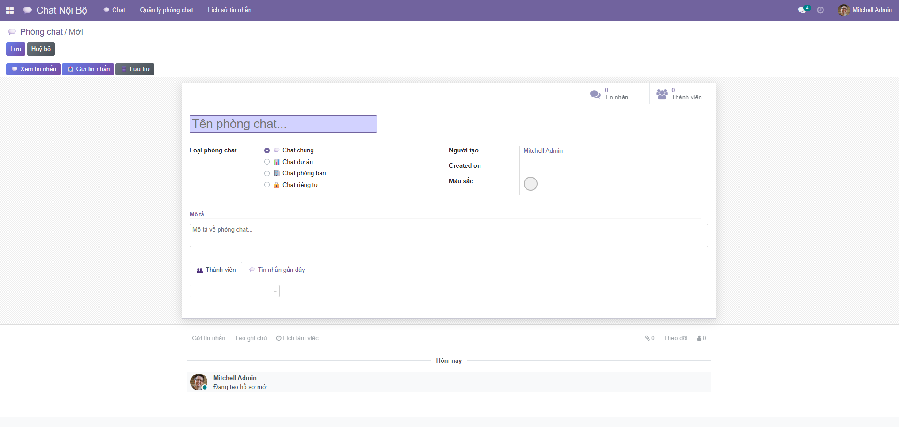

### Tính năng

- ✅ Realtime messaging
- 🔔 Thông báo tin nhắn mới
- 👁️ Hiển thị trạng thái đã đọc
- 🔍 Tìm kiếm tin nhắn
- 📎 Lưu trữ file đính kèm

#### 📸 Screenshots


*Danh sách các phòng chat đang tham gia*


*Giao diện chat realtime với tin nhắn và file đính kèm*


*Tạo và quản lý thành viên phòng chat*

---

## 🤖 Demo Module AI Chatbot

### Sử dụng AI Assistant

1. Vào bất kỳ **Phòng chat** nào
2. Gõ `@ai` trước câu hỏi của bạn
3. AI sẽ trả lời dựa trên dữ liệu thực tế

### Các lệnh AI thường dùng

```
@ai có bao nhiêu task?
→ AI liệt kê số lượng task theo trạng thái

@ai task nào sắp đến deadline?
→ AI cảnh báo các task sắp hết hạn

@ai tóm tắt chat hôm nay
→ AI tóm tắt nội dung cuộc trò chuyện

@ai tạo task thiết kế UI deadline 15/02
→ AI tạo task mới từ lệnh

@ai dự án nào đang chậm tiến độ?
→ AI phân tích tình hình các dự án

@ai gợi ý task tiếp theo
→ AI gợi ý task dựa trên priority
```

### Tính năng nổi bật

- 🎯 **Thông minh**: Hiểu ngữ cảnh và trả lời chính xác
- ⚡ **Nhanh chóng**: Phản hồi tức thì trong chat
- 📊 **Phân tích**: Đưa ra insight về dự án và task
- ✅ **Hành động**: Có thể tạo task, cập nhật trạng thái
- 🔗 **Tích hợp**: Kết nối với tất cả module khác

#### 📸 Screenshots

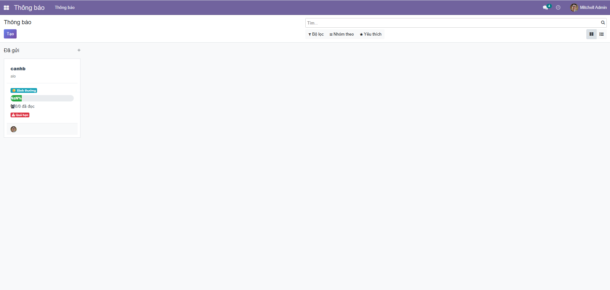
*AI Assistant trả lời câu hỏi và tạo task từ chat*

---

## 🤖 Demo Module AI Chatbot Assistant


### Sử dụng AI Assistant

1. Vào **bất kỳ phòng chat nào** đã tạo
2. Gõ `@ai` trước câu hỏi của bạn
3. Ví dụ các lệnh:

**Hỏi về công việc:**
```
@ai có bao nhiêu task đang làm?
@ai task nào sắp hết hạn?
@ai ai đang làm task thiết kế UI?
```

**Tóm tắt cuộc trò chuyện:**
```
@ai tóm tắt chat hôm nay
@ai những điểm chính trong cuộc họp?
```

**Tạo công việc mới:**
```
@ai tạo task thiết kế database, deadline 15/02, giao cho Nguyễn Văn A
```

**Phân tích dự án:**
```
@ai tình hình dự án Website thế nào?
@ai có task nào bị trễ không?
@ai gợi ý task nên làm tiếp theo
```

### Tính năng AI

- 🧠 **Hiểu ngữ cảnh**: AI hiểu được context của dự án và các task
- ⚡ **Trả lời nhanh**: Phản hồi trong vài giây
- 📊 **Phân tích thông minh**: Đưa ra insight về tiến độ công việc
- 🎯 **Gợi ý hành động**: Đề xuất task ưu tiên dựa trên deadline và priority
- ⏰ **Cảnh báo proactive**: Nhắc nhở về deadline sắp tới
- 📝 **Tóm tắt tự động**: Tổng hợp các điểm quan trọng từ cuộc trò chuyện

### Lưu ý

- AI chỉ hoạt động trong phòng chat đã cài đặt module `ai_chatbot`
- Cần có ít nhất 1 dự án và một số task để AI có thể phân tích
- AI không thể thực hiện các thao tác yêu cầu quyền đặc biệt (xóa, thay đổi quyền)

---

## 🎯 Workflow Tích hợp

### Ví dụ: Quy trình làm việc hoàn chỉnh

```
1. Tạo DỰ ÁN
   ├─ Tên: Website Ecommerce
   ├─ Thêm NHÂN VIÊN vào dự án
   └─ Tự động tạo PHÒNG CHAT cho dự án

2. Tạo CÔNG VIỆC trong dự án
   ├─ Phân công cho nhân viên
   ├─ Gửi THÔNG BÁO tự động cho người được giao
   └─ Thảo luận trong PHÒNG CHAT dự án

3. THEO DÕI tiến độ
   ├─ Update trạng thái công việc
   ├─ Gửi THÔNG BÁO khi hoàn thành
   └─ Comment & thảo luận trong CHAT

4. HOÀN THÀNH dự án
   ├─ Gửi THÔNG BÁO thành công
   └─ Lưu trữ chat & tài liệu
```

---

## 🔧 Troubleshooting

### Lỗi thường gặp

#### 1. Module không xuất hiện trong Apps

```bash
# Update module list
python odoo-bin -c odoo.conf -d <database> -u base --stop-after-init
```

#### 2. Lỗi database connection

- Kiểm tra PostgreSQL đang chạy: `docker ps`
- Kiểm tra thông tin kết nối trong `odoo.conf`
- Restart PostgreSQL: `docker-compose restart`

#### 3. Port 8069 đã được sử dụng

```bash
# Kiểm tra process đang dùng port
lsof -i :8069  # Linux/Mac
netstat -ano | findstr :8069  # Windows

# Thay đổi port trong odoo.conf
xmlrpc_port = 8070
```

#### 4. Module cài đặt bị lỗi

```bash
# Xóa module và cài lại
python odoo-bin -c odoo.conf -d <database> --uninstall <module_name>
python odoo-bin -c odoo.conf -d <database> -i <module_name>
```

---

# 📁 Cấu trúc dự án

```
TTDN-16-04-N9/
├── 📁 addons/                    # Thư mục chứa modules
│   ├── 📁 nhan_su/              # ⭐ Module Quản lý Nhân sự
│   ├── 📁 quan_ly_du_an/        # ⭐ Module Quản lý Dự án
│   ├── 📁 quan_ly_cong_viec/    # ⭐ Module Quản lý Công việc
│   ├── 📁 thong_bao/            # ⭐ Module Thông báo
│   ├── 📁 chat_noi_bo/          # ⭐ Module Chat nội bộ
│   ├── 📁 ai_chatbot/           # ⭐ Module AI Chatbot Assistant
│   ├── 📁 auto_backup/          # Module Auto backup
│   ├── 📁 github_upload/        # Module Upload GitHub
│   └── ... (Odoo core modules)
│
├── 📁 odoo/                      # Odoo core framework
├── 📁 setup/                     # Setup scripts
├── 📁 debian/                    # Debian package files
├── 📁 doc/                       # Documentation
│
├── 📄 odoo-bin                   # Odoo executable
├── 📄 odoo.conf                  # Cấu hình Odoo (tạo từ template)
├── 📄 odoo.conf.template         # Template cấu hình
├── 📄 docker-compose.yml         # Docker setup cho PostgreSQL
├── 📄 requirements.txt           # Python dependencies
├── 📄 README.md                  # Tài liệu này
└── 📄 LICENSE                    # License file
```

---

## 🤝 Đóng góp

Mọi đóng góp đều được chào đón! Vui lòng:

1. Fork repository
2. Tạo feature branch (`git checkout -b feature/AmazingFeature`)
3. Commit changes (`git commit -m 'Add some AmazingFeature'`)
4. Push to branch (`git push origin feature/AmazingFeature`)
5. Tạo Pull Request

---

## 📝 License

Project này được phân phối dưới giấy phép **LGPL-3**. Xem file `LICENSE` để biết thêm chi tiết.

---

## 👥 Tác giả

- **GitHub**: [@danganh1009](https://github.com/danganh1009),[Anos2003](https://github.com/Anos2003)
- **Repository**: [TTDN-16-04-N9](https://github.com/danganh1009/TTDN-16-04-N9)

---

## 📧 Liên hệ & Hỗ trợ

- **Email**: admin@example.com
- **Website**: http://www.yourcompany.com

---

## 🎓 Tài liệu tham khảo

- [Odoo Official Documentation](https://www.odoo.com/documentation/16.0/)
- [Odoo Developer Tutorial](https://www.odoo.com/documentation/16.0/developer.html)
- [PostgreSQL Documentation](https://www.postgresql.org/docs/)
- [Python Documentation](https://docs.python.org/3.10/)

---

<div align="center">


    
